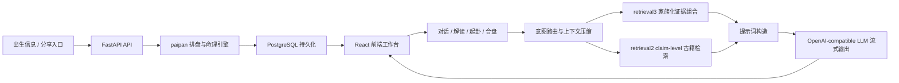

# 系统架构文档

> 版本：2026-05-12，基于当前 `HEAD`（`codex/bazi-agent-e2e-benchmark`）和 `git log --all` 梳理。
> 注意：本仓库有多条并行分支。本文的“当前架构”只描述当前工作区代码；“演进记录”会标注已经合入主线、仍停留在侧分支、或只作为实验设计存在的内容。

---

## 1. 项目定位

“有时”是一款八字分析与关系合盘 Web App。它的核心不是单次问答，而是围绕一个命盘持续组织信息：用户先生成命盘或分享卡，再进入排盘、古籍旁证、流式解读、多轮对话、梅花易数起卦、合盘阅读、媒介卡片和订阅权限等产品面。

当前代码的主链路是：



架构上要特别区分两件事：

- 当前已落地的是“排盘引擎 + 检索增强 + 专家提示词 + 流式对话”的服务架构。
- `claude/modest-faraday-946e30` 分支曾实现过 tool-calling agent loop、`ChartDossier`、`UserProfile`、`memory_store` 等实验。当前运行代码里没有 `app/agents`、tool execution、对应模型类或 memory store 服务；迁移历史里保留了 `0033` 这类实验痕迹。当前分支新增的是 agent 评测基准，不是完整 agent 运行时。

---

## 2. 多分支演进记录

这份文档不是只看 `main` 写的。当前分支图里有 `main`、`origin/main`、多条 `claude/*` 实验分支，以及当前 `codex/bazi-agent-e2e-benchmark`。从 `git log --all` 看，项目大致经历了以下阶段：

| 时间 | 演进重点 | 当前状态 |
|---|---|---|
| 2026-04 下旬 | 从早期 Node/MVP 与 JS 排盘过渡到 Python `paipan`、FastAPI、React 产品化。Plan 7.x 完成用神、行运、transmutation、cross interaction 等命理引擎层。 | 已合入，当前 `paipan/` 是基础引擎。 |
| 2026-04-28 左右 | `retrieval2`：claim-level 古籍检索，替代旧的粗粒度检索。 | 已合入，当前仍服务古籍旁证与 chat 注入。 |
| 2026-05-02 至 2026-05-07 | 用户体系、会话持久化、合盘邀请、合盘阅读、卡片工作台、身份同步、onboarding、头像昵称等产品化能力快速展开。 | 已合入，当前前后端都有对应模块。 |
| 2026-05-08 | 古书定调重做：persona/verdict 双池、classics polisher、pageflip 书页视觉；同时卡片视觉进入 p5 粒子、翻转卡、合盘 aura 阶段。 | 已合入大部分能力；视觉和古籍面板仍是当前产品的一部分。 |
| 2026-05-09 | 两条线并行：一条是 `retrieval2` compound multi-label，另一条是 agent loop 实验分支。 | retrieval2 改造已合入；agent loop 停留在侧分支，不是当前运行时。 |
| 2026-05-10 | `retrieval3` 家族化检索重建，加入 8 类 retriever 与 composer；卡片、合盘、媒介卡片与 tooltip 继续迭代。 | 已合入，当前 chat 证据组织主要看 retrieval3 + retrieval2 fallback。 |
| 2026-05-10 至 2026-05-11 | 命局能量曲线 K 线、多阶段评分、tooltip clamp、登陆页与隐私/安全表达、媒介卡片收缩到更少类型。 | 已合入，当前有 `kline` 组件与媒介封面缓存。 |
| 2026-05-12 | 世界观提示词注入到多个 LLM 入口；chat 停止、续写、重答、分页、截断处理；隐私协议门；当前分支增加 bazi agent E2E benchmark。 | 当前 `HEAD` 包含评测基准；`main` 包含隐私协议门。 |

当前本地分支关系也值得留意：

- `main` 在 `a37900d`，比 `origin/main`（`0b78739`）本地领先。
- 当前分支 `codex/bazi-agent-e2e-benchmark` 只比 `main` 多一个提交：`a34dc78 feat(eval): add bazi agent e2e benchmark`。
- `claude/modest-faraday-946e30` 是 agent loop 实验，不应误写进当前代码架构。
- 多条 `claude/*` 分支已经被 merge 回主线，也有少数仍是侧支或落后分支；看项目演进时应使用 `git log --all`，而不是只看当前分支。

---

## 3. 仓库结构

```text
bazi-analysis/
├── frontend/                 # React 19 + Vite 8 前端
│   ├── src/
│   │   ├── components/       # app 工作台、卡片、合盘、后台、K 线、落地页
│   │   ├── lib/              # API、analytics、media、格式化、K 线辅助
│   │   ├── store/            # Zustand 状态
│   │   └── styles/           # 全局样式
│   └── tests/                # node:test 前端测试
├── server/                   # FastAPI + SQLAlchemy 2.0 后端
│   ├── app/
│   │   ├── api/              # auth / charts / conversations / hepan / card / billing / admin 等 HTTP 层
│   │   ├── auth/             # 当前用户、可选用户、权限与限额依赖
│   │   ├── billing/          # 订阅、支付 provider、checkout/webhook
│   │   ├── core/             # config / db / crypto / logging / rate limit
│   │   ├── data/             # cards / hepan / media / skill 内置数据
│   │   ├── llm/              # OpenAI-compatible client 与流式封装
│   │   ├── models/           # User / Chart / Conversation / Event / Subscription / Hepan 等模型
│   │   ├── prompts/          # context / expert / router / style / verdicts / sections / gua 等提示词构造
│   │   ├── retrieval2/       # claim-level 古籍检索
│   │   ├── retrieval3/       # 家族化 retriever + composer
│   │   ├── schemas/          # Pydantic 请求/响应 schema
│   │   └── services/         # chart / chat / card / hepan / quota / subscription 等业务服务
│   ├── alembic/              # 数据库迁移
│   ├── evals/                # 当前分支新增的 agent 评测数据
│   ├── scripts/              # 评测脚本等
│   └── tests/                # pytest 后端测试
├── paipan/                   # 纯 Python 排盘与命理分析引擎
│   ├── paipan/
│   │   ├── compute.py        # 主入口
│   │   ├── analyzer.py       # 命局分析合成
│   │   ├── li_liang.py       # 十神力量
│   │   ├── ge_ju.py          # 格局识别
│   │   ├── he_ke.py          # 合冲刑会等关系
│   │   ├── yongshen.py       # 用神 engine
│   │   ├── xingyun.py        # 大运/流年评分
│   │   ├── solar_time.py     # 真太阳时
│   │   ├── zi_hour.py        # 子时派别
│   │   └── china_dst.py      # 中国历史夏令时
│   └── tests/
├── classics/                 # 古籍真本
├── shards/                   # LLM 提示词片段
├── docs/                     # 架构、设计、release notes、skill 文档
├── archive/                  # 历史实现归档
├── package.json              # 根脚本：前后端启动、测试、构建
└── pyproject.toml            # uv workspace：paipan + server
```

---

## 4. 前端架构

前端已经不是旧文档里的“无路由、screen 字段切屏”形态。当前入口 `frontend/src/App.jsx` 使用 `react-router-dom`，由路由划分产品面：

| 路由 | 页面 | 职责 |
|---|---|---|
| `/` | `LandingHome` | 首页，承接单人卡片与合盘入口。 |
| `/card/:slug` | `CardScreen` | 分享卡预览。 |
| `/hepan/mine` | `MyHepanPage` | 登录用户的合盘列表。 |
| `/hepan/:slug` | `HepanScreen` | 合盘邀请、填写、结果、阅读和合盘聊天。 |
| `/legal/:slug` | `LegalPage` | 法务与协议页面。 |
| `/pricing` | `PricingPage` | 订阅与支付入口。 |
| `/admin` | `AdminDashboard` | 数据概览、运营、事件与访客监控。 |
| `/app/*` | `AppShell` | 主工作台：命盘、古籍、K 线、对话、起卦等。 |

主要组件边界：

- `components/AppShell.jsx` 是登录后的命盘工作台壳层。
- `components/Chart.jsx`、`Force.jsx`、`Meta.jsx`、`Dayun.jsx`、`LiunianBody.jsx` 负责命盘与行运展示。
- `components/Chat.jsx`、`ConversationSwitcher.jsx`、`Gua.jsx`、`GuaCard.jsx` 负责多轮对话和起卦体验。
- `components/ClassicsPanel.jsx` 与 `ClassicsBookLoader.jsx` 负责古籍定调与书页视觉。
- `components/card/*` 负责单人卡片生成、预览、导出、分享与工作台内卡片。
- `components/hepan/*` 负责合盘邀请、B 方填写、合盘阅读、合盘消息、列表和漏斗。
- `components/kline/KLineChart.jsx` 负责命局能量曲线。
- `components/admin/AdminDashboard.jsx` 负责后台监控。

状态仍由 Zustand 管理，但职责已经从早期“全靠前端本地缓存”转为“服务端持久化 + 前端热缓存”。用户、命盘、会话、消息、合盘和订阅状态都通过 API 同步；本地状态主要用于当前视图、输入草稿、加载状态和局部缓存。

---

## 5. 后端架构

后端入口是 `server/app/main.py`。启动时会加载配置、密钥、卡片 JSON、合盘 JSON，并启动订阅到期扫描任务。静态资源挂载包括：

- `/static/cards`
- `/static/hepan/illustrations`
- `/static/media-cache`
- `/static/avatars`

当前 API 面如下：

| 模块 | 路由前缀 | 职责 |
|---|---|---|
| public | `/api/config`, `/api/cities` | 前端配置、城市列表与 ETag 缓存。 |
| auth | `/api/auth` | 短信、注册、登录、游客、登出、账号导出/删除、头像、昵称、绑定手机号。 |
| sessions | `/api/sessions` | 登录会话列表与删除。 |
| charts | `/api/charts` | 命盘增删改查、恢复、重算、古书定调、总论、七板块、大运、流年、chips。 |
| conversations | `/api/charts/{chart_id}/conversations`, `/api/conversations` | 会话创建/列表/重命名/删除/恢复、消息分页、流式回复、起卦。 |
| card | `/api/card`, `/api/card/{slug}` | 单人分享卡生成与预览。 |
| hepan | `/api/hepan` | 合盘邀请、我的合盘、完成邀请、合盘结果、流式阅读、合盘消息。 |
| media | `/api/media/cover` | 歌曲/电影封面抓取、缓存和取色。 |
| quota | `/api/quota` | 当前用户当日额度。 |
| billing | `/api/billing` | 订阅快照、checkout、取消、支付 webhook。 |
| admin | `/api/admin` | 指标、运营面板、事件、访客、人工订阅开通。 |
| tracking | `/api/track` | 前端行为事件。 |
| wx | `/api/wx/jsapi-ticket` | 微信 JS-SDK 签名。 |

后端层次基本遵循：

```text
api/        HTTP 边界、鉴权依赖、请求/响应模型
services/   业务编排，负责事务语义、缓存、LLM 流、权限检查
models/     SQLAlchemy 持久化模型
schemas/    Pydantic schema
prompts/    LLM 输入构造
retrieval*/ 古籍证据召回与组合
paipan/     通过 workspace package 调用的排盘与命理引擎
```

---

## 6. LLM、提示词与检索

LLM 层以 OpenAI-compatible 协议为抽象，服务端对前端主要输出 SSE。当前常见事件包括文本增量、模型信息、意图信息、检索引用、完成、错误、起卦结果等。2026-05-12 的提交补强了 `finish_reason`、截断续写、主动停止后继续写、重答去重和老消息分页体验。

提示词系统分为几类：

| 文件 | 职责 |
|---|---|
| `prompts/context.py` | 将完整命盘压缩为 LLM 可用的结构化上下文。 |
| `prompts/style.py` | 全局风格和世界观约束。 |
| `prompts/expert.py` | 主聊天专家提示词。 |
| `prompts/verdicts.py` | 命局总论。 |
| `prompts/sections.py` | 七板块解读。 |
| `prompts/dayun_step.py` | 单步大运展开。 |
| `prompts/liunian.py` | 流年展开。 |
| `prompts/chips.py` | 建议问题。 |
| `prompts/router.py` | 意图路由。 |
| `prompts/gua.py` | 梅花易数起卦解读。 |
| `prompts/anchor.py` | 古籍锚点构造。 |

检索层当前有两代共存：

- `retrieval2`：claim-level 古籍切片、BM25、命盘事实、意图策略、LLM selector、存储和 tagger。它是旧 v1 检索的替代者，仍作为多个入口的基础证据源。
- `retrieval3`：面向 chat 的家族化 evidence composer。当前包含穷通宝鉴、三命通会 8/9 卷、格局、概念、神煞、六亲、外貌、理论 fallback 等 retriever，并把结果组合成 EvidenceCard。它会跳过闲聊、起卦、媒介类意图。

当前主对话不是“自由发挥的 LLM 聊天”，而是：

```text
用户消息
→ chat_router 判断意图和 retrieval focus
→ conversation_memory 取上下文
→ compact_chart_context 注入命盘结构
→ retrieval3 / retrieval2 注入古籍或术语证据
→ prompts/expert 构造最终输入
→ LLM SSE
→ message 与 usage log 持久化
```

---

## 7. 命理引擎

`paipan/` 是独立 Python package，服务端通过 `services/paipan_adapter.py` 调用。它负责把出生信息变成结构化命盘，不把关键计算交给 LLM。

主要能力：

- 出生地与真太阳时：`cities.py`、`solar_time.py`、`china_dst.py`、`zi_hour.py`。
- 基础排盘：`compute.py` 输出四柱、十神、藏干、纳音、农历、大运、流年等。
- 命局分析：`analyzer.py` 汇总力量、格局、合冲会刑、用神与行运。
- 十神力量：`li_liang.py`、`force.py`。
- 格局识别：`ge_ju.py`。
- 干支关系：`he_ke.py`。
- 用神 engine：`yongshen.py` + `yongshen_data.py`，承接调候、格局、扶抑与 transmutation。
- 行运 engine：`xingyun.py` + `xingyun_data.py`，负责大运/流年评分、机制标签、cross interaction。

这一层是业务事实源。前端展示、后端缓存、LLM 提示词都应该优先使用它输出的结构化字段，而不是重新在提示词里推算。

---

## 8. 产品与数据面

当前产品已经包含早期架构文档没有覆盖的多个业务面：

| 业务面 | 关键代码 |
|---|---|
| 用户与隐私 | `api/auth.py`、`services/auth.py`、`models/user.py`，包含游客、短信、协议、导出、删除、头像、昵称。 |
| 命盘工作台 | `api/charts.py`、`services/chart.py`、`services/chart_llm.py`、`frontend/src/components/AppShell.jsx`。 |
| 多轮对话 | `api/conversations.py`、`services/conversation_chat.py`、`services/message.py`、`models/conversation.py`。 |
| 古书定调 | `services/classics_polisher.py`、`services/classics_persona_match.py`、`components/ClassicsPanel.jsx`。 |
| 单人卡片 | `api/card.py`、`services/card/*`、`data/cards/*`、`components/card/*`。 |
| 合盘 | `api/hepan.py`、`services/hepan/*`、`models/hepan_invite.py`、`models/hepan_message.py`、`components/hepan/*`。 |
| 媒介卡片 | `api/media.py`、`data/media/movie_posters.json`、`server/var/media-cache/`。 |
| K 线能量曲线 | `components/kline/KLineChart.jsx`、`frontend/src/lib/kline/*`。 |
| 订阅与限额 | `api/billing.py`、`billing/*`、`services/quota.py`、`services/subscription.py`、`models/quota.py`、`models/subscription.py`。 |
| 追踪与后台 | `api/tracking.py`、`api/admin.py`、`models/event.py`、`components/admin/AdminDashboard.jsx`。 |
| 微信分享 | `api/wx.py`、`weixin-js-sdk`。 |

数据库迁移位于 `server/alembic/versions/`，当前历史已经到 `0034_llm_usage_logs_retrieval_claims.py`。模型层覆盖用户、命盘、缓存、会话、消息、事件、卡片分享、合盘邀请、合盘消息、订阅、支付与 LLM usage log。

---

## 9. 当前分支的评测基准

当前 `codex/bazi-agent-e2e-benchmark` 分支新增的是评测基准：

```text
server/evals/bazi_agent/
├── cases_v0_2.jsonl
├── rubric.yaml
└── source_passages.jsonl

server/scripts/eval/
├── bazi_agent_scorer.py
└── run_bazi_agent_benchmark.py

server/tests/unit/test_bazi_agent_eval.py
```

它的目标是评估八字回答在命盘事实、引用、推理、冲突处理、有用性、可读性、安全边界、产品约束等维度上的表现。`run_bazi_agent_benchmark.py` 支持 deterministic `--dry-run` 和对已有结果评分；它还不是线上 agent runtime。

---

## 10. 开发与验证入口

常用脚本位于根 `package.json`：

```bash
npm run dev:front
npm run dev:back
npm run build
npm run test:paipan
npm run test:server
npm run test:frontend
npm run test
```

后端开发服务默认：

```text
http://127.0.0.1:3101
```

前端由 Vite 启动。Python workspace 由 `uv` 管理，`pyproject.toml` 声明了 `paipan` 和 `server` 两个成员。

---

## 11. 维护原则

1. 架构判断先看当前 `HEAD` 的文件，再看 `main` 与 `origin/main`，最后用 `git log --all` 理解侧分支实验。
2. 不把历史实验分支写成当前运行能力。尤其是 agent loop、tool execution、长期记忆模型这条线，目前只应作为分支演进记录。
3. 命理计算以 `paipan` 输出为事实源；LLM 只负责组织、解释、追问和表达。
4. 古籍证据优先走 `retrieval3` 的家族化 composer；需要 claim-level 或 legacy 旁证时再落到 `retrieval2`。
5. 前端新增产品面时，应同时检查路由、Zustand 状态、API 客户端、追踪事件、权限/额度、移动端布局和后台指标。
6. 后端新增 LLM 入口时，应同时接入 quota、usage log、finish_reason、SSE 错误事件、缓存策略和提示词世界观。
7. 文档更新时，避免复用旧测试数量或旧路由表。测试文件数量和 API 路由都在快速变化，应从代码重新核对。
